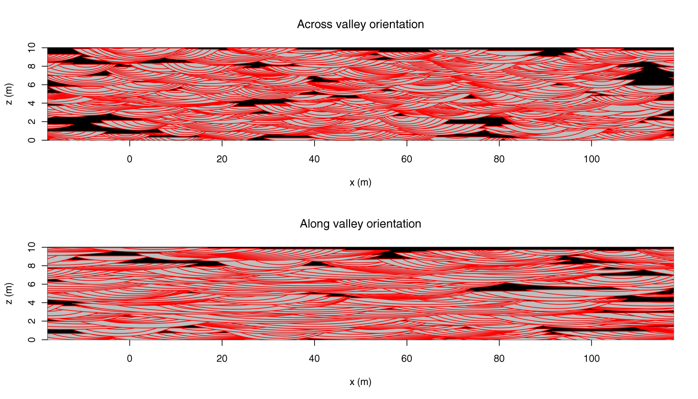

# CBRDM
Coarse Braided River Deposit Model

There is a critical need in hydrogeological modeling for geologically more realistic representation of the subsurface. Indeed, widely-used representations of the subsurface heterogeneity based on smooth basis functions such as cokriging or the pilot-point approach fail at reproducing the connectivity of high permeable geological structures that control subsurface solute transport. To realistically model the connectivity of high permeable structures of coarse, braided river deposits, multiple-point statistics and object-based models are promising alternatives. We therefore propose a new object-based model that, according to a sedimentological model, mimics the dominant processes of floodplain dynamics. Contrarily to existing models, this object-based model possesses the following properties: (1) it is consistent with field observations (outcrops, ground-penetrating radar data, etc.), (2) it allows different sedimentological dynamics to be modeled that result in different subsurface heterogeneity patterns, (3) it is light in memory and computationally fast, and (4) it can be conditioned to geophysical data. In this model, the main sedimentological elements (scour fills with open-framework–bimodal gravel cross-beds, gravel sheet deposits, open-framework and sand lenses) and their internal structures are described by geometrical objects. Several spatial distributions are proposed that allow to simulate the horizontal position of the objects on the floodplain as well as the net rate of sediment deposition. The model is grid-independent and any vertical section can be computed algebraically. Furthermore, model realizations can serve as training images for multiple-point statistics.

See also: [PDF presentation: A 3D object-based model to simulate highly-heterogeneous,
coarse, braided river deposits](https://emanuelhuber.github.io/publications/2016_huber-et-al_AGU_3D-object-based-model-braided-deposits.pdf)




## How to cite

Huber E., Huggenberger P., Caers J. (2016) Presentation: A 3D object-based model to simulate highly-heterogeneous, coarse, braided river deposits. AGU 2016 Fall Meeting, San Francisco, California, USA, 12–16 December 2016. DOI: [10.13140/RG.2.2.29333.32489](http://dx.doi.org/10.13140/RG.2.2.29333.32489)


## How to install/load

```r
if(!require("devtools")) install.packages("devtools")
devtools::install_github("emanuelhuber/CBRDM")
library(CBRDM)
```

## Notes
This is an ongoing project. If you have any questions, don't hesitate to contact me:

emanuel.huber@alumni.ethz.ch

Thank you!

## Related publications

- E. Huber, P. Huggenberger (2016) Subsurface flow mixing in coarse, braided river deposits. Hydrology and Earth System Sciences, 20:2035–2046. DOI: [10.5194/hess-20-2035-2016](http://dx.doi.org/10.5194/hess-20-2035-2016)<br/>
[PDF file](https://emanuelhuber.github.io/publications/2016_huber-and-huggenberger_subsurface-flow-mixing.pdf)

- Huber E. and Huggenberger P. (2015) Morphological perspective on the sedimentary characteristics of a coarse, braided reach: Tagliamento River (NE Italy) . Geomorphology, 248: 111–124. DOI: [10.1016/j.geomorph.2015.07.015](http://dx.doi.org/10.1016/j.geomorph.2015.07.015)<br/>
[PDF file](https://emanuelhuber.github.io/publications/2015_huber-and-huggenberger_morphological-perspective-sedimentology.pdf)

- Huggenberger, P., Regli, C., 2006. A sedimentological model to characterize braided river deposits for hydrogeological applications. In: Sambrook Smith, G.H., Best, J.L., Bristow, C.S., Petts, G.E. (Eds.), Braided Rivers: Process, Deposits, Ecology and Management. Blackwell Publishing Ltd, Oxford, UK, pp. 51–74. DOI: [10.1002/9781444304374.ch3](http://dx.doi.org/10.1002/9781444304374.ch3).

- Beres, M., Huggenberger, P., Green, A.G., Horstmeyer, H., 1999. Using two- and three-dimensional georadar methods to characterize glaciofluvial architecture. Sediment. Geol. 129 (1–2), 1–24. DOI: [10.1016/S0037-0738(99)00053-6](http://dx.doi.org/10.1016/S0037-0738(99)00053-6).

- Siegenthaler, C., Huggenberger, P., 1993. Pleistocene Rhine gravel: deposits of a braided river system with dominant pool preservation. Geol. Soc. Lond., Spec. Publ. 75, 147–162. DOI: [10.1144/GSL.SP.1993.075.01.09](http://dx.doi.org/10.1144/GSL.SP.1993.075.01.09).


## Short tutorial
### Trough fill simulation
This model simulates trough fills with cross-bedding and horizontal layers. The trough fills are approximated by a series of truncated ellipsoids.
We create an instance of the class `Trough` using the constructor function `trough()`. The objects properties and positions are drawn from random distribution:


```r
# Trough Fills
TF <- trough(pos   = matrix(runif(9, 10,90), nrow=3, ncol=3),
             size  = cbind(rnorm(3, 40, 5), rnorm(3, 20,2), 
                          rnorm(3, 2, 0.5)),
             theta = runif(3,0,3.14),
             rH    = rep(6, 3))
```

To visualise this trough fills, use the function `plotTopView()`:

```r
plotTopView(TF, border = "blue", col = "grey", asp = 1)
```

To plot one specific trough fill:
```r
plotTopView(TF[2], border = "blue", col = "green", asp = 1, add = TRUE)
```

Add cross-bedding:

```r
para <- list(nF   = 10,      # nF cross-beds
             rpos = 0.75,    # 0 <= rpos <=1
             phi  = 2.2)     # orientation angle
TF <- crossBedding(TF, para)
plotTopView(TF, border = "blue", col = "grey", asp = 1)
```

Different cross-bedding for each trough fills:
```r
para <- list(nF   = c(10, 3, 30),      # nF cross-beds
             rpos = c(0, 0.75, 1),     # 0 <= rpos <=1
             phi  = c(0, -1, 2.2))     # orientation angle
TF <- crossBedding(TF, para)
plotTopView(TF, border = "blue", col = "grey", asp = 1)
```

### Braided river deposit simulation
The object properties (`L` = length, `rLW`= length-width ratio, `rLH` = length-height ratio, `theta` = orientation angle, `rH` = truncation ratio ) are defined by probability distributions (here the uniform probability distribution). 

The vertical position of the layers is defined by a Poisson process with parameter `ag` (the rate of sediment deposition = mean thickness of sediment deposited per event).

The horizontal distribution of trough fills on each layers is defined by a Strauss process with parameters `bet` (beta), `gam` (gamma) and `d` interaction distance (the function `rStrauss` in the `spatstat` R-package). Warning: a bad parameter choice may lead to extremely long computations.

The cross-bedding parameters are also defined according probability distribution. Note that here `nF` defines the cross-bed thickness (I will change that next time).


```r
para <- list("L"      = list(type = "runif", min = 40, max = 70),
             "rLW"    = list(type = "runif", min = 3, max = 4),
             "rLH"    = list(type = "runif", min = 45, max = 66),
             "theta"  = list(type = "runif", min = -20 * pi / 180, 
                                            max = 20 * pi / 180),
             "rH"     = 2,
             "vpp"    = list(type = "poisson",
                             lambda = 0.1),
             "hpp"    = list(type = "strauss",
                             bet = 1e-4,
                             gam = 0.2,
                             d = 100,
                             fd = c(5, 1),
                             nit = 1000, n0 = 3),
             "nF"     = list(type = "rint", min = 2, max = 5),
             "rpos"   = list(type = "runif", min = 0.65, max = 1), 
             "phi"    = list(type = "runif", min = -1.5, max = 1.5)
             )
```

Now we define the simulation box:
```r
modbox <- list("x" = c(0,100),
               "y" = c(0,200),
               "z" = c(0,10)
             )
```

And run the simulation:
```r
mod <- sim(modbox, hmodel = "strauss", para)  # takes some times...
```

Top view (the layers are "transparent") and show the vertical section lines:
```r
plotTopView(mod, border = "red", col = "grey", asp = 1)
lv <- c(1, 0,  -50)
lh <- c(0, 1,  -50)
l  <- c(1, 2, -250)
RConics::addLine(lv, col = "blue",  lwd = 3)
RConics::addLine(lh, col = "black", lwd = 4)
RConics::addLine(l,  col = "green", lwd = 4)
```

#### Vertical sections

* Vertical section along the line `lv`:

    ```r
    smod <- section(mod, lv)
    plotSection(smod, border = "red", col = "grey", asp = 2, ylim = c(0, 10),
                xlim = c(0,100), ylab = "z (m)", xlab = "x (m)")
    title("Vertical section along 'lv' (blue line)")
    ```

* Vertical section along the line `lh`:

    ```r
    smod <- section(mod, lh)
    plotSection(smod, border = "red", col = "grey", asp = 2, ylim = c(0, 10),
                xlim = c(-50, 150), ylab = "z (m)", xlab = "y (m)")
    title("Vertical section along 'lh' (black line)")
    ```

* Vertical section along the line `l`:

    ```r
    smod <- section(mod, lhv)
    plotSection(smod, border = "red", col = "grey", asp = 5, ylim = c(0, 10),
                xlim = c(-20, 170), ylab = "z (m)", xlab = "x' (m)")
    title("Vertical section along 'l' (green line)")
    ```

#### Discretisation/pixelisation 3D

1. Define the pixelisation box (`x`, `y`, `z`) as well as the pixel resolution 
(`dx`, `dy`, `dz`).

    ```r
    mbox <- list(x = modbox$x, y = modbox$y, z = modbox$z, 
                dx = 1, 
                dy = 1, 
                dz = 0.1)
    ```

2. Pixelise

    ```r
    PIX <- pixelise(mod, mbox)
    ```
    
    The function `pixelise()` maps the object on the grid and attributes unique
    identifier (integer) to the pixels belonging to the same object. The layers 
    have negative values while the throughs have positive values.
    
    ```r
    library(plot3D)
    # horizontal section
    plot3D::image2D(PIX$XYZ[,, 50], x = PIX$x, y = PIX$y)
    
    # vertical section at x = 50.5
    plot3D::image2D(PIX$XYZ[which(PIX$x == 50.5),,], x = PIX$y, y = PIX$z)
    ```
    
#### Set hydraulic properties and plot section (pixels)

1. Set the facies identifier to the pixels:
    - 0 = layers
    - 1 = bimodal gravel (trough)
    - 2 = open-framework gravel
    
    ```r
    FAC <- setProp(PIX$XYZ, type = c("facies"))
    
    # horizontal section
    plot3D::image2D(FAC[,, 50], x = PIX$x, y = PIX$y)
    
    # vertical section at x = 50.5
    plot3D::image2D(FAC[which(PIX$x == 50.5),,], x = PIX$y, y = PIX$z)
    ```
    
    The hydraulic properties of the facies are given by the data `faciesProp`:
    ```r
    data(faciesProp)
    faciesProp # the facies hydraulic properties
    ```
    
2. set hydraulic conductivity    
    
    ```r
    HK <- setProp(PIX$XYZ, type = c("K"), fprop = faciesProp)
    
    # horizontal section
    plot3D::image2D(HK[,, 50], x = PIX$x, y = PIX$y)
    
    # vertical section at x = 50.5
    plot3D::image2D(HK[which(PIX$x == 50.5),,], x = PIX$y, y = PIX$z)
    ```

3. vertical anisotropy of the hydraulic conductivity

    ```r
    VANI <- setProp(PIX$XYZ, type = c("Kvani"), fprop = faciesProp)
    
    # horizontal section
    plot3D::image2D(VANI[,, 50], x = PIX$x, y = PIX$y)
    
    # vertical section at x = 50.5
    plot3D::image2D(VANI[which(PIX$x == 50.5),,], x = PIX$y, y = PIX$z)
    ```
    
4.  porosity
    ```r
    PORO <- setProp(PIX$XYZ, type = c("p"), fprop = faciesProp)
    
    # horizontal section
    plot3D::image2D(PORO[,, 50], x = PIX$x, y = PIX$y)
    
    # vertical section at x = 50.5
    plot3D::image2D(PORO[which(PIX$x == 50.5),,], x = PIX$y, y = PIX$z)
    ```


#### Plot a cube of hydraulic conductivity:

```r
rnxyz <- dim(PIX$XYZ)
vy <- PIX$y
vx <- rep(max(PIX$x), length(PIX$x))
vz <- matrix(rep(PIX$z, each = length(vy)), ncol = length(vy), 
             nrow = length(vx), byrow = TRUE)
M1 <- plot3D::mesh(vx, vy)

plot3D::surf3D(M1$x, M1$y, vz, colvar = t(HK[,nxyz[2],]), 
        col = plot3D::jet2.col(201),
        bty = "f", cex = 0.01, pch = 20,  clim = range(HK),
        clab = "hydraulic conductivity (m/s)", ticktype = "detailed",
        theta = 40 , expand = 5, scale = FALSE, resfac = 0, clog = TRUE,
        xlim = modbox$x, ylim = modbox$y, 
        zlim = modbox$z, #extent3D(gwMod)[5:6],
        xlab = "x", ylab = "y", shade = TRUE, ltheta = -125, lphi = 45,
        colkey = list(plot = TRUE, width = 0.5, length = 0.5,
        cex.axis = 0.8, side = 1),
        col.axis = "black", col.panel = "white", col.grid = "grey",
        lwd.panel = 1, lwd.grid = 2, box = TRUE)
        
vy <- (PIX$x)
vx <- rep(0, length(PIX$x))
vz <- matrix(rep(PIX$z, each = length(vx)), ncol = length(vx), 
             nrow = length(vy), byrow = TRUE)
M1 <- plot3D::mesh(vx, vy)

plot3D::surf3D(M1$y, M1$x, vz, colvar = t(HK[1,,]), 
        col = plot3D::jet2.col(201), add = TRUE, expand = 5, scale = FALSE, 
        resfac = 0, clog = TRUE,  clim = range(HK),
        colkey = list(plot = FALSE))


vx <- rev(PIX$x)
vy <- PIX$y
vz <- matrix(rep(rep(max(PIX$z), length(PIX$z)), each = length(vy)), 
              ncol = length(vy), nrow = length(vx), byrow = TRUE)
M1 <- plot3D::mesh(vx, vy)

plot3D::surf3D(M1$x, M1$y, vz, colvar = (HK[,,nxyz[3]]), 
        col = plot3D::jet2.col(201), add = TRUE, expand = 5, scale = FALSE, 
        resfac = 0, clog = TRUE,  clim = range(HK), 
        colkey = list(plot = FALSE))
```
